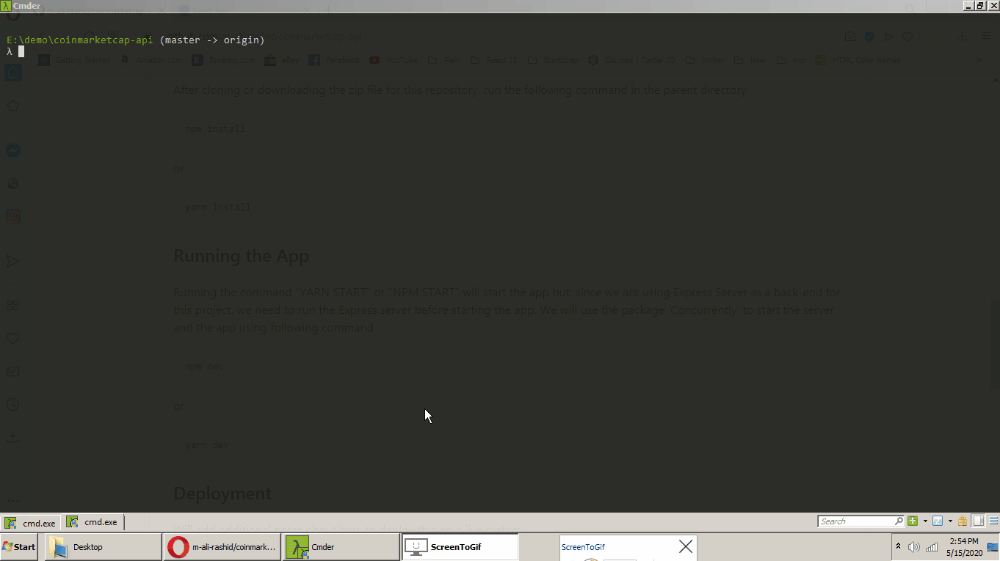

# CoinMarketCap-API

I have created a sample ReactJS code that uses CoinMarketCap's free crypto API to get the real-time cryptocurrency and exchange trade data for Bitcoin, Etherium, and other cryptocurrencies. Take a look at the preview of this App.



## Getting Started

These instructions will get you a copy of the project up and running on your local machine for development and testing purposes. See deployment for notes on how to deploy the project on a live system.

### Prerequisites

Make sure you have npm or yarn package manager installed.

### Installing

After cloning or downloading the zip file for this repository, run the following command in the parent directory

```
npm install
```
or
```
yarn install
```

## Running the App

Running the command "YARN START" or "NPM START" will start the app but, since we are using Express Server as a back-end for this project, we need to run the Express server before starting the app. We will use the package 'Concurrently' to start the server and the app using following command

```
npm dev
```
or
```
yarn dev
```

## Deployment

Will add additional notes about how to deploy this on a live system

## Built With

* [ReactJS](https://reactjs.org/) - The JavaScript Library
* [ExpressJS](https://expressjs.com/) - Web Framework for Node.js
* [nodemon](https://nodemon.io/) - utility that will monitor your code for changes
* [Bootstrap](https://getbootstrap.com/) - HTML, CSS and JS library to create UI

## Contributing

Please read [CONTRIBUTING.md](https://gist.github.com/PurpleBooth/b24679402957c63ec426) for details on our code of conduct, and the process for submitting pull requests to us.

## Versioning

We use [SemVer](http://semver.org/) for versioning. For the versions available, see the [tags on this repository](https://github.com/m-ali-rashid/coinmarketcap-api/tags).

## Authors

* **Muhammad Ali Rashid** - *Initial work* - [m-ali-rashid](https://github.com/m-ali-rashid)

## License

This project is licensed under the MIT License - see the [LICENSE.md](LICENSE.md) file for details

## Acknowledgements

* [**Saad Ibrahim**](https://github.com/saadibrahim) - [*react-native-top-crypto*](https://github.com/saadibrahim/react-native-top-crypto)
